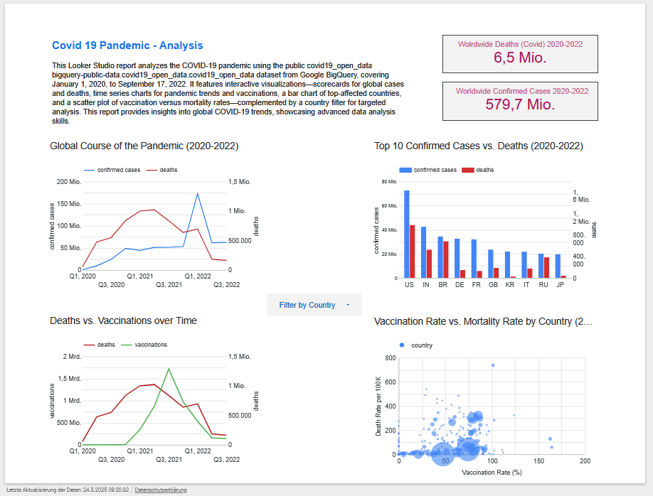
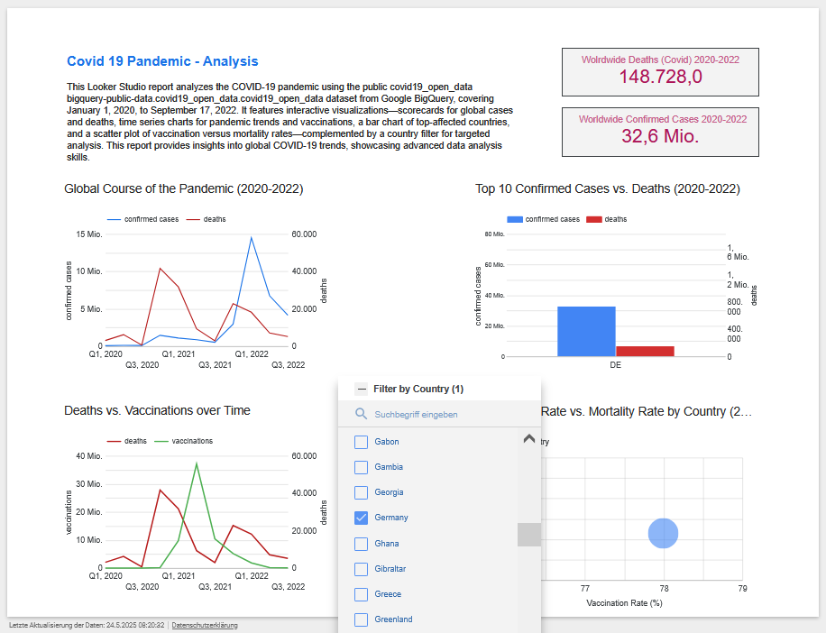

# COVID-19 Data Analysis
Portfolio project analyzing COVID-19 data with BigQuery and Looker Studio

## Overview
This portfolio project analyzes global COVID-19 data from January 2020 to September 2022, demonstrating skills in data cleaning, SQL querying, and interactive visualization. Using Google BigQuery and Looker Studio, it explores trends in confirmed cases, deaths, and vaccinations, with an interactive country filter.

## Data Source
- **Dataset**: Google BigQuery’s public covid19_open_data [(Link)](https://console.cloud.google.com/marketplace/product/bigquery-public-datasets/covid19-open-data?inv=1&invt=AbyPVQ&project=covid19-analysis-457510).
- **Time Period**: January 1, 2020 – September 17, 2022.
- **Key Metrics**: Confirmed cases, deaths, vaccinations, population.

## Steps
1. **Schema Exploration**: Inspected dataset columns (e.g., date, location_key, new_confirmed, new_persons_vaccinated).
2. **Data Preview**: Analyzed initial data for countries (e.g., CA, DE, US).
3. **Quality Check**: Identified NULLs, duplicates, negative values, and outliers in BigQuery.
4. **Data Cleaning**: Created `Covid19_data_cleaned.csv` table, handling missing data and capping outliers.
5. **Visualization**: Built Looker Studio report with:
   - **Scorecards**: Global cases and deaths.
   - **Time Series**: Trends in cases, deaths, and vaccinations.
   - **Bar Chart**: Top 10 countries by cases and deaths.
   - **Scatter Plot**: Vaccination rates vs. mortality (see screenshots below).

## Visualizations
- **Global Report**: Overview of worldwide COVID-19 metrics.
  

- **Filtered Report**: Example with Germany filter applied.
  

## Files
- [Covid19_cleaned_data.csv](Covid19_cleaned_data.csv): Cleaned dataset (CSV)
- [covid19_analysis_workflow.sql](covid19_analysis_workflow.sql): SQL queries for analysis (SQL)
- [docs/Covid19_LookerReport.pdf](docs/Covid19_LookerReport.pdf): Global report (PDF)
- [docs/Covid19_LookerReport_Filter.pdf](docs/Covid19_LookerReport_Filter.pdf): Filtered report (PDF)
- [docs/Covid19_LookerReport.PNG](docs/Covid19_LookerReport.PNG): Global report screenshot (PNG)
- [docs/Covid19_LookerReport_Filter.PNG](docs/Covid19_LookerReport_Filter.PNG): Filtered report screenshot(PNG)

## Interactive Report
Explore the interactive Looker Studio report [here](https://lookerstudio.google.com/s/kKpnHr47Nvg).

## Tools Used
- **Google BigQuery**: Data processing and querying.
- **Looker Studio**: Interactive dashboard creation.
- **GitHub**: Code and documentation hosting.

## Learnings
- Advanced SQL for data quality and aggregation.
- Designing interactive visualizations with Looker Studio.

## Contact
Reach out via [LinkedIn]( www.linkedin.com/in/roxana-schwartz-rls) or [email](mailto:roxana@rschwartz.de)
